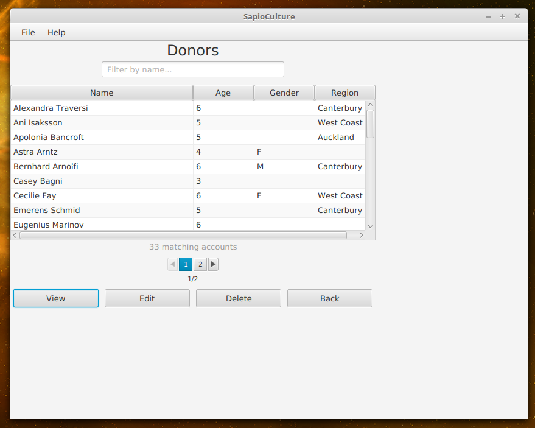
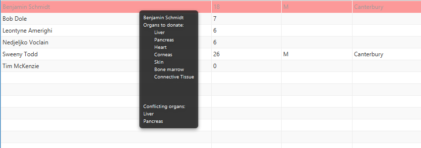

# User Manual

Definitions 
 -NHI-National health index number, a unique 7 Alphanumeric code. The 1st 3 characters must be uppercase letters that are not "I" or "O". the last 4 characters are digits with the last being non-zero.

##Command Line Interface
Please note that commands must be entered on a single line. Multi-line commands will be recognised as invalid.

----------------------------------------------------------------------------------
Creating Profiles

    -Template [Create name=<Full Name> dateOfBirth=<date of birth> nhi=<Nhi number>

    -Full Name -All the names the person has. the first name will be stored as their first name, while the lsat name given will be stored as the last. All names in between will be stored as other names. There should be no space between the equals sign and the first name.
    -date of birth -The date of birth of the account holder. The format is yyyyMMdd. y =year, M=month, d = day. There should be no space inbetween the equals and the date of birth.
    -nhi - The unique number as described by the definition [NHI]. There should be no space between the equals and the nhi number.

    -All three tokens (name=, dateOfBirth= , nhi=) are required for an account to be created, otherwise the execution will fail. 
    -If any of the values given are empty, the command will fail and the application will return to the main menu.

    Example: [Create name=Steven Philip Jones dateOfBirth=19971201 nhi=ASD9876]
    Example: [Create name=Steve Jobs dateOfBirth=19760523 nhi=ABC1234]

---------------------------------------------------------------------------------
Updating a Donor.

    -Template [update <nhi code> <object> <attribute> <value>]

    -nhi code, as described in the definitions.Required as it provides uniqueness for each profile
    -Object -[profile, attributes, organs] decides which section of the profile the user wants to edit.
    -Attribute. Depends on what the object was.
         Valid attributes for profile: 
	        title: Donor's title, a string to up to 10 alphabetical characters.
	        givenName: A mandatory string that is up to 50 alphabetical characters. Includes spaces, commas, apostrophes, and dashes.
	        otherName: An optional string up to 100 alphabetical characters. Includes spaces, commas, apostrophes, and dashes.
 	        lastName: An optional string up to 100 alphabetical characters. Includes spaces, commas, apostrophes, and dashes.
	        dateOfBirth : String formatted to YYYYMMDD. Must be before current date.
	        dateOfDeath: String formatted to YYYYMMDD. Must be before current date and after the donor's birth date (if it exists).
	        gender: Char code in M = Male, F = Female, O = Other, or U = Unknown/Unspecified
	        livedInUKFlag: true/false string on whether donor has lived in UK, Ireland, or France between 1980 and 1996
        Valid attributes for attribute:
	        height: A double between 0.0 and 4.0 meters.
	        weight: A double greater than 0.0 kg.
	        bloodType: A string code, one of A-, A+, B-, B+, AB-, AB+, O-, O+.
        Valid attributes for organs: 
            liver, kidneys, pancreas, heart, lungs, intestines, corneas, middleEars skin, bone, boneMarrow, connectiveTissue, all
            -To change whether an organ is donatable or not, for value simply type true or false. If nothing is entered, the value will automatically be set to false
   -Value, entirely dependent on the attribute. See description of attribute above for what type of input is required.

    Example: [update ABC1234 profile givenName Johny]  updates the givenName of account ABC1234 with Johny.
	Example: [update XYZ6789 organs all true]  updates donor registry for account XYZ6789 to donate all their organs.
        
------------------------------------------------------------------------------------
Viewing an Account(s)

    -Template #1 [view nhi <nhi number> <object>]  Views the account with the given NHI number

        -nhi number- as defined in the definition for NHI
        -object -[log, attributes, organs, all] decides which section of the profile the user wants to view.
            -log, the change log of the account. When changes have been made, they are logged here with a timestamp and whatever the change was.
            -attributes, the set attributes of the account
            -organs, the organs that are deemed donatable by the user
            -all, all information regarding the user.  

 
    -Template #2 [view name <first name> <last name> <object>]   Views all donors with the given first and last names

        -first name, the first name of the user.
        -last name, the lsat name of the user.
        -object, [log, attributes, organs, all] decides which section of the profile the user wants to view.
            -log, the change log of the account. When changes have been made, they are logged here with a timestamp and whatever the change was.
            -attributes, the set attributes of the account
            -organs, the organs that are deemed donatable by the user
            -all, all information regarding the user.   

    
    -Template #3 [view donors <object>]  Views all donors with the chosen object

        -object, [log, attributes, organs, all] decides which section of the profile the user wants to view.
            -log, the change log of the account. When changes have been made, they are logged here with a timestamp and whatever the change was.
            -attributes, the set attributes of the account
            -organs, the organs that are deemed donatable by the user
            -all, all information regarding the user. 

    Example: [view nhi ASD9876 all]  Views all details known for the account with nhi number=ASD9876
    Example: [view name Steve Jobs attributes] Views all attributes of all accounts with a first name Steve and last name Jobs
    Example: [view donors organs] Views all donatable organs of all accounts in the database
    
----------------------------------------------------------------------------
Importing Account(s)

    -Template [import]
        -This imports all the account json files located in the accounts folder within the project.
----------------------------------------------------------------------------
Deleting Account(s)
    -Template [delete <nhi>]
        -Where nhi is the national health index number of the account to be deleted
-----------------------------------------------------------------------------
Exporting Account(s)
    -Template [export]
        -This exports all of the saved json files from the current runtime into json files found in the accounts folder within the project
---------------------------------------------------------------------------------
Help
    -Template [help <case>]
        -case = [all, create, update, view, import, export, delete, launch]
        -Prints a template regarding which case was called.
--------------------------------------------------------------------------------
Launching the GUI
    -Template [launch]
        -launches the gui   
## Graphical User Interface
A graphical user interface can be launched with the command 'launch' in the command
line interface.
### Search
 
The image above shows the search screen. This can be accessed through the clinician's
 menu by clicking the 'Search' or 'View All Profiles' button.
 
 When no text is 
 entered into the search field at the top of the screen, all profiles will be 
 shown. Profiles which do not contain the contents of the search field in their 
 full name will be removed from the table below. If there are more than 30 matches 
 with the given search criteria, then the matches will be divided into pages of 30. 
 Switching between pages is accomplished with the controls beneath the table.
 
 The table has four columns showing the name, age, gender, and region of each 
 account. It is possible to sort the table by each attribute in ascending 
 and descending order by clicking on the column header.
 
 An account in the table can be selected by clicking on it. The view, edit, 
 and delete buttons then allow you to interact with the selected profile. The
 close button will return the you to the clinician's main menu.
 
Hovering over a profile in the table will show the name of the profile in a 
tool-tip. If the donor has registered their intent to donate organs, the list
of organs they are willing to donate will be shown as well.

If you wish to view multiple profiles at once, you can double click on several
profiles in the table. This will open each profile in a separate window.

Any accounts that are donating the same organ that they are receiving will have
a red highlight and their tool-tips will include which organs are 'conflicting'

Similarly, when viewing the account profile, the labels for the organs will be
red if they are conflicting.

